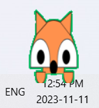
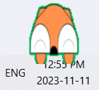
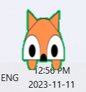
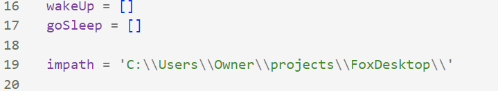
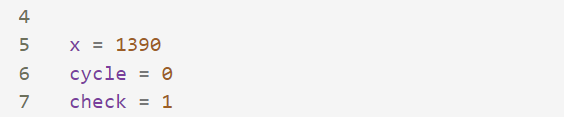
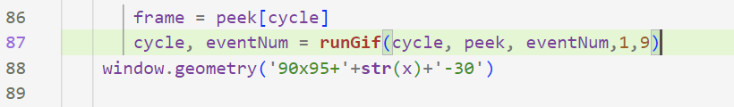

# Fox Desktop Pet

## Project Information
The following project is a fox desktop pet. Just a little guy who sits on your computer and watches you work, and occasionally goes to sleep.

  

## How To Run
### Getting the files
To run this program, download the main.py and the gifsFrames folder. Edit the impath variable (line 19, see screenshot below) to where the gifsFrames is located. 

You can also edit the x variable (line 5) and the values in window.geometry (line 88) if you want the fox to be in a different location. Its current location places it on the right-hand corner above the taskbar based on a 1920 x 1080 sized laptop screen

### Create an Executable 
This project can be run using your preferred IDE, but if you want you can also make it an executable.
To do so, run the following commands in your terminal 

1. pip install pyinstaller
2. pyinstaller "main.py"

This will create a dist folder which contains the executable file. Click on it to run the program.
Note that every time you edit the main.py file, you will need to create a new executable.
