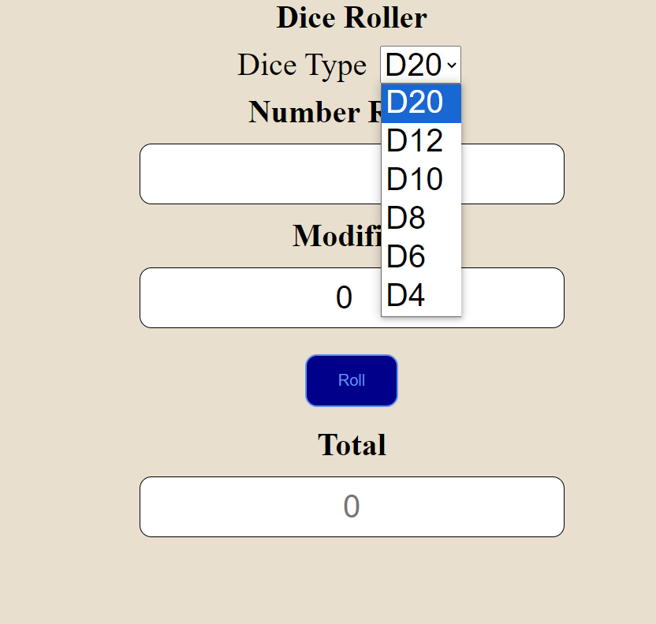
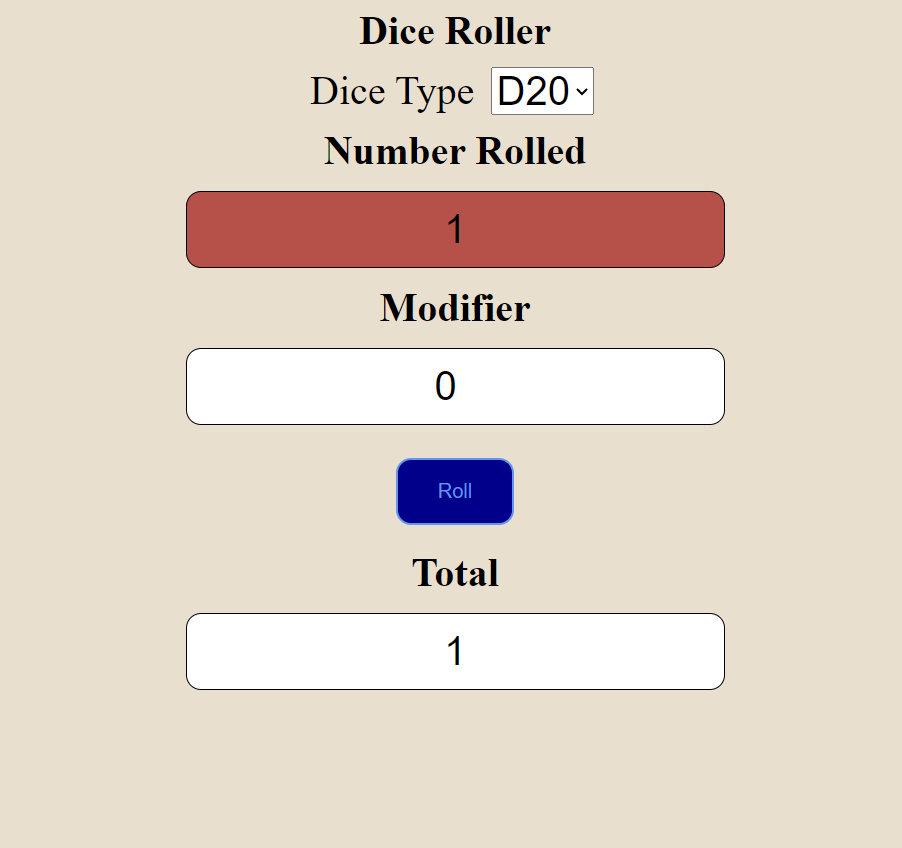
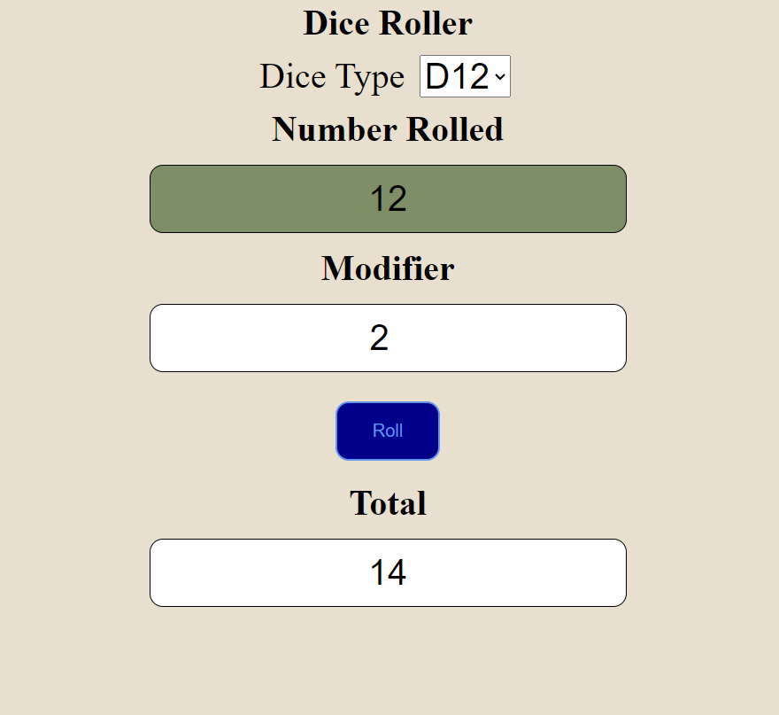

# Dice Roller

### Project Information
The following project is a dice roller. The user can select from the 6 most common dice shapes and the outcome is displayed.
It also allows the user to add a modifier that will be added to final total.
[]

If a one is rolled, the number rolled box will change from white to red. If the highest possible number is rolled,
the number rolled box will change from white to green.

[]

### How To Run
To run this program, first download the files off of GitHub using git clone.
Open the project folder in the IDE of your choice (VSCode, Intellij ect). Build and run the index.html file.

