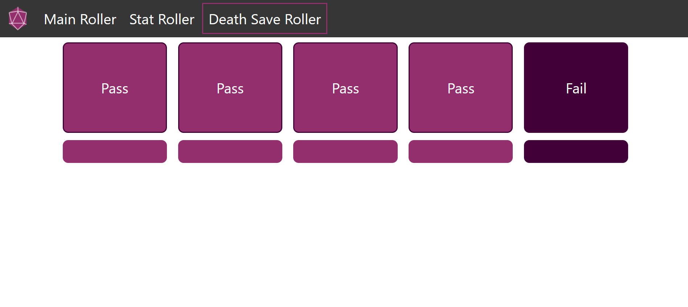
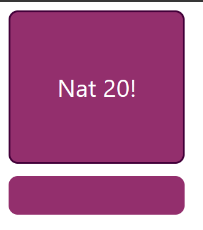

# [Dice Roller](https://diceroller.neocities.org/)

### Project Information
The following project is a dice roller based on the different ways you roll dice in a dnd game

The Main Dice Roller page allows the user to select from the 6 most common dice shapes, choose how many dice to roll, and add any modifers to the roll.
The numbers rolled and the total outcome are both displayed.

The Hit Point Roller lets the user roll 4d6 6 times. The function drops the lowest of the 4 rolls and adds the remaining dice together before displaying the total

The Death Save Roller lets the user roll 5 d20s one at a time. If the roll is 10 or above the word "Pass" is displayed, if it's less than 10, the word "Fail" is displayed.

Because these rolls are treated differently in dnd during death saves, these are displayed differently if rolled

 

This website is hosted on [neocities](https://diceroller.neocities.org/)

