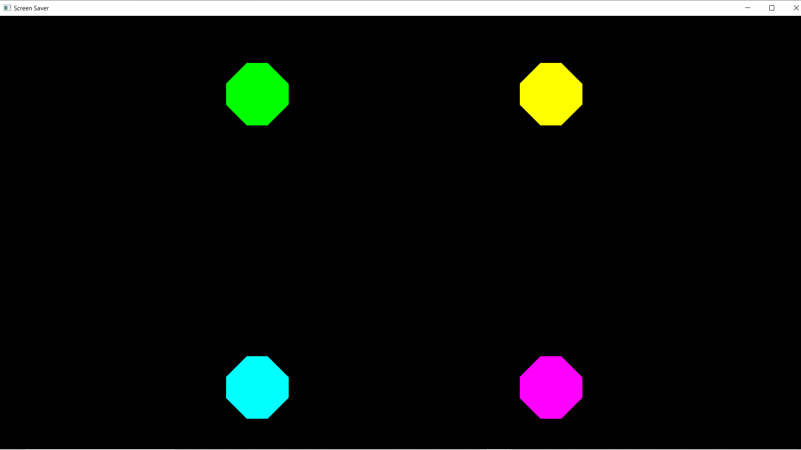
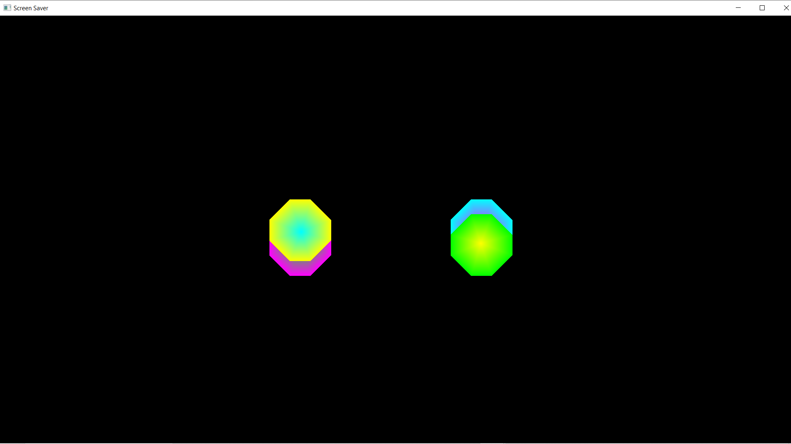
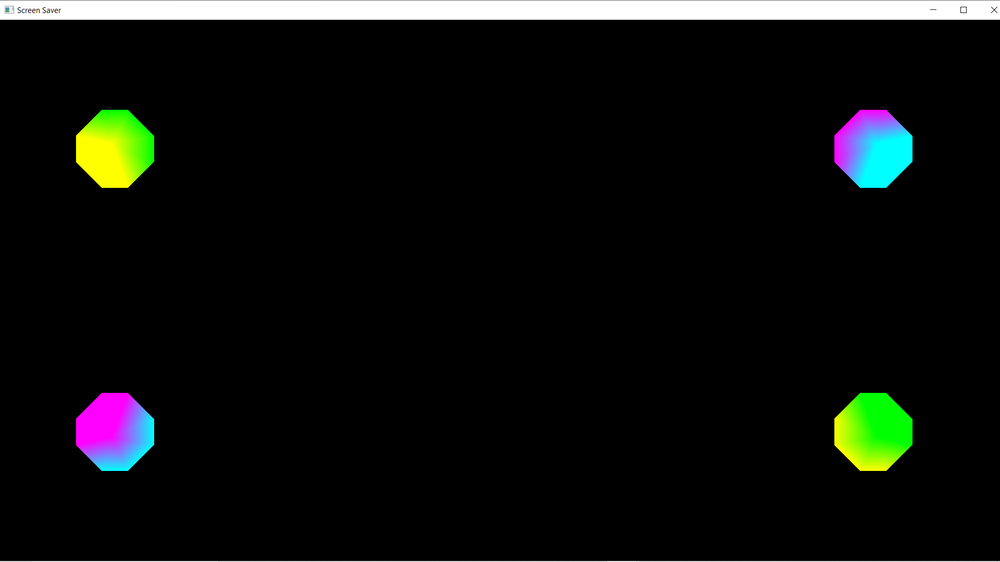

# Screensaver Project

### Project Information
The following project is a screensaver, consisting of 4 octagons that move around the screen. As the approach the edges of the screen,
they fold and change colour. Every 17 seconds, the center of each octagon changes colour.

 

Created for a 1920 x 1080 sized laptop screen

### How To Run
To run this program, first download the files off of GitHub using git clone.
Open the project folder in the IDE of your choice (VSCode, Intellij ect). Build and run the Main.cpp file

### How To Add To Your Computer as a Screensaver
Go into your file explorer and locate the Project1.scr file. Right-click on the file and click install.
