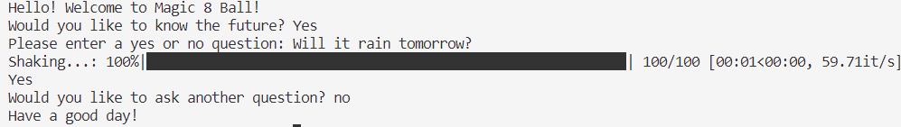

# Magic 8 Ball Project

### Project Information
The following project is a random number generator, themed after a magic 8 ball. 
The user inputs a question and after a loading bar graphic, an outcome is printed to the console. 

### How To Run
To run this program, first download the files off of GitHub using git clone.
Open the project folder in the IDE of your choice (VSCode, Intellij ect). Build and run the main.py file. 